# INNODB锁

[TOC]

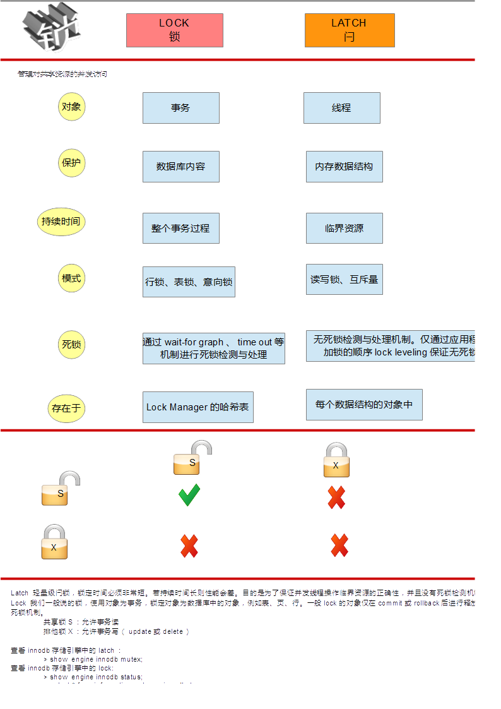

## 设置INNODB事务隔离级别

### 实践1：查看innodb默认的事务隔离级别

知识点：

1. 可以查看局部变量`@@tx_isolation`和全局变量`@@global.tx_isolation`
2. 局部变量在会话中生效，而全局变量是在所有会话中生效，局部覆盖全局。

>查看当前会话中的事务隔离级别

```shell
 MariaDB [(none)]> select @@tx_isolation;
+-----------------+
| @@tx_isolation  |
+-----------------+
| REPEATABLE-READ |
+-----------------+
1 row in set (0.00 sec)
```

查看全局的事务隔离级别

```shell
MariaDB [(none)]> select @@global.tx_isolation;
+-----------------------+
| @@global.tx_isolation |
+-----------------------+
| REPEATABLE-READ       |
+-----------------------+
1 row in set (0.00 sec)

MariaDB [(none)]> show variables like "tx_isolation";
+---------------+-----------------+
| Variable_name | Value           |
+---------------+-----------------+
| tx_isolation  | REPEATABLE-READ |
+---------------+-----------------+
1 row in set (0.00 sec)

MariaDB [(none)]> select * from information_schema.global_variables where variable_name like "%isolation%";
+---------------+-----------------+
| VARIABLE_NAME | VARIABLE_VALUE  |
+---------------+-----------------+
| TX_ISOLATION  | REPEATABLE-READ |
+---------------+-----------------+
1 row in set (0.03 sec)
```

### 实践2：改变单个会话的隔离级别


知识点：

1.用户可以用SET TRANSACTION语句改变单个会话的隔离级别。

```shell
SET SESSION  TRANSACTION ISOLATION LEVEL
                       {READ UNCOMMITTED | READ COMMITTED
                        | REPEATABLE READ | SERIALIZABLE}
```

2.会话结束重新开启新的会话，则使用全局变量的值


session1设置RR

由于默认的隔离级别就是RR，因此不用设置，查看一下即可

```shell
MariaDB [(none)]> select @@tx_isolation;
+-----------------+
| @@tx_isolation  |
+-----------------+
| REPEATABLE-READ |
+-----------------+
1 row in set (0.00 sec)
```

session2设置RC

```shell
MariaDB [information_schema]> select @@tx_isolation;
+-----------------+
| @@tx_isolation  |
+-----------------+
| REPEATABLE-READ |
+-----------------+
1 row in set (0.00 sec)

MariaDB [information_schema]> set session transaction isolation level read committed;
Query OK, 0 rows affected (0.00 sec)

MariaDB [information_schema]> select @@tx_isolation;
+----------------+
| @@tx_isolation |
+----------------+
| READ-COMMITTED |
+----------------+
1 row in set (0.00 sec)
```

session2结束会话，开启新的session3

```shell
MariaDB [information_schema]> exit
Bye
[root@localhost ~]# mysql
Welcome to the MariaDB monitor.  Commands end with ; or \g.
Your MariaDB connection id is 6
Server version: 5.5.44-MariaDB MariaDB Server

Copyright (c) 2000, 2015, Oracle, MariaDB Corporation Ab and others.

Type 'help;' or '\h' for help. Type '\c' to clear the current input statement.

MariaDB [(none)]> select @@tx_isolation;
+-----------------+
| @@tx_isolation  |
+-----------------+
| REPEATABLE-READ |
+-----------------+
1 row in set (0.00 sec)
```

### 实践3：改变单个实例的隔离级别

知识点：

1.用户可以用SET TRANSACTION语句改变单个实例的隔离级别。

```shell
SET GLOBAL  TRANSACTION ISOLATION LEVEL
                       {READ UNCOMMITTED | READ COMMITTED
                        | REPEATABLE READ | SERIALIZABLE}
```

2.实例结束重新开启新的实例，则使用配置文件中的参数值，或程序编译时的参数值。


```shell
MariaDB [(none)]> set global transaction isolation level read committed;
Query OK, 0 rows affected (0.00 sec)

MariaDB [(none)]> select @@tx_isolation;
+-----------------+
| @@tx_isolation  |
+-----------------+
| REPEATABLE-READ |
+-----------------+
1 row in set (0.00 sec)

MariaDB [(none)]> select @@global.tx_isolation;
+-----------------------+
| @@global.tx_isolation |
+-----------------------+
| READ-COMMITTED        |
+-----------------------+
1 row in set (0.00 sec).
```


当前会话中，局部变量的值为RR，全局变量的值为RC，而局部会覆盖全局，所以当前会话中的隔离级别还是RR，我们需要退出当前会话，开启新的会话。


```shell
[root@localhost ~]# mysql
Welcome to the MariaDB monitor.  Commands end with ; or \g.
Your MariaDB connection id is 8
Server version: 5.5.44-MariaDB MariaDB Server

Copyright (c) 2000, 2015, Oracle, MariaDB Corporation Ab and others.

Type 'help;' or '\h' for help. Type '\c' to clear the current input statement.

MariaDB [(none)]> select @@tx_isolation;
+----------------+
| @@tx_isolation |
+----------------+
| READ-COMMITTED |
+----------------+
1 row in set (0.00 sec)

MariaDB [(none)]> select @@global.tx_isolation;
+-----------------------+
| @@global.tx_isolation |
+-----------------------+
| READ-COMMITTED        |
+-----------------------+
1 row in set (0.00 sec)
```

在会话中通过修改全局变量的方式，只能让当前的实例生效，如果服务重启了，则失效。

```shell
[root@localhost ~]# systemctl restart mariadb
[root@localhost ~]# mysql
Welcome to the MariaDB monitor.  Commands end with ; or \g.
Your MariaDB connection id is 2
Server version: 5.5.44-MariaDB MariaDB Server

Copyright (c) 2000, 2015, Oracle, MariaDB Corporation Ab and others.

Type 'help;' or '\h' for help. Type '\c' to clear the current input statement.

MariaDB [(none)]> select @@tx_isolation;
+-----------------+
| @@tx_isolation  |
+-----------------+
| REPEATABLE-READ |
+-----------------+
1 row in set (0.00 sec)

MariaDB [(none)]> select @@global.tx_isolation;
+-----------------------+
| @@global.tx_isolation |
+-----------------------+
| REPEATABLE-READ       |
+-----------------------+
1 row in set (0.00 sec)
```

### 实践4：改变所有实例的隔离级别

知识点：

1.修改配置文件，为所有实例和连接设置默认隔离级别。

```shell
[mysqld]
transaction-isolation = {READ-UNCOMMITTED | READ-COMMITTED
                         | REPEATABLE-READ | SERIALIZABLE}
```

2.innodb默认的隔离级别为 REPEATABLE-READ

```shell
[root@localhost ~]# vim /etc/my.cnf
transaction-isolation=read-committed
[root@localhost ~]# systemctl restart mariadb
[root@localhost ~]# mysql -e "select @@tx_isolation"
+----------------+
| @@tx_isolation |
+----------------+
| READ-COMMITTED |
+----------------+
[root@localhost ~]# mysql -e "select @@global.tx_isolation"
+-----------------------+
| @@global.tx_isolation |
+-----------------------+
| READ-COMMITTED        |
+-----------------------+
```

---

## 区分INNODB事务隔离级别

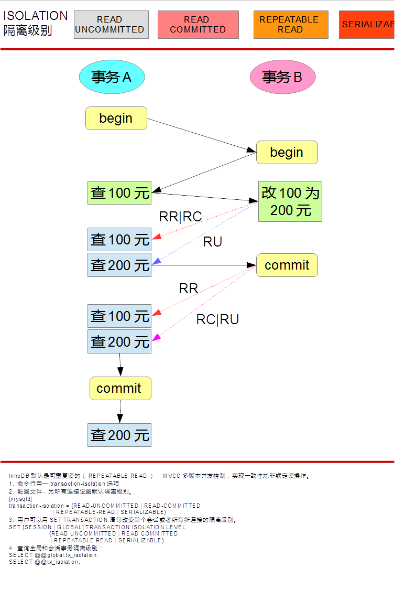

InnoDB 中的隔离级详细描述：

- `READ UNCOMMITTED` 这通常称为 'dirty read'：non-locking SELECTs 的执行使我们不会看到一个记录的可能更早的版本；因而在这个隔离度下是非 'consistent' reads；另外，这级隔离的运作如同 READ COMMITTED。
- `READ COMMITTED` 有些类似 Oracle 的隔离级。所有 SELECT ... FOR UPDATE 和 SELECT ... LOCK IN SHARE MODE 语句只锁定索引记录，而不锁定之前的间隙，因而允许在锁定的记录后自由地插入新记录。以一个唯一地搜索条件使用一个唯一索引(unique index)的 UPDATE 和 DELETE，仅仅只锁定所找到的索引记录，而不锁定该索引之前的间隙。但是在范围型的 UPDATE and DELETE中，InnoDB 必须设置 next-key 或 gap locks 来阻塞其它用户对范围内的空隙插入。 自从为了 MySQL 进行复制(replication)与恢复(recovery)工作'phantom rows'必须被阻塞以来，这就是必须的了。Consistent reads 运作方式与 Oracle 有点类似： 每一个 consistent read，甚至是同一个事务中的，均设置并作用它自己的最新快照。
- `REPEATABLE READ` 这是 InnoDB 默认的事务隔离级。. SELECT ... FOR UPDATE, SELECT ... LOCK IN SHARE MODE, UPDATE, 和 DELETE ，这些以唯一条件搜索唯一索引的，只锁定所找到的索引记录，而不锁定该索引之前的间隙。 否则这些操作将使用 next-key 锁定，以 next-key 和 gap locks 锁定找到的索引范围，并阻塞其它用户的新建插入。在 consistent reads 中，与前一个隔离级相比这是一个重要的差别： 在这一级中，同一事务中所有的 consistent reads 均读取第一次读取时已确定的快照。这个约定就意味着如果在同一事务中发出几个无格式(plain)的SELECTs ，这些 SELECTs 的相互关系是一致的。
- `SERIALIZABLE` 这一级与上一级相似，只是无格式(plain)的 SELECTs 被隐含地转换为 SELECT ... LOCK IN SHARE MODE。

---

* 开启四个会话session1-4，分别设置不同的隔离级别

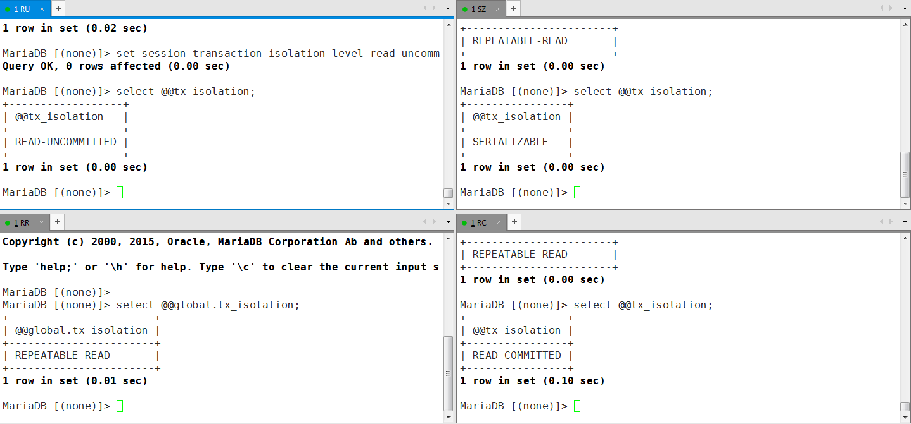

* 再开启一个会话session5默认使用RR隔离级别

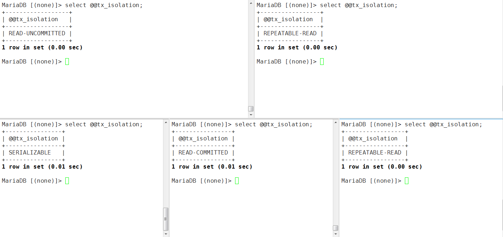

* session1-5都开启一个事务，查看test库中t1表中id=100的行

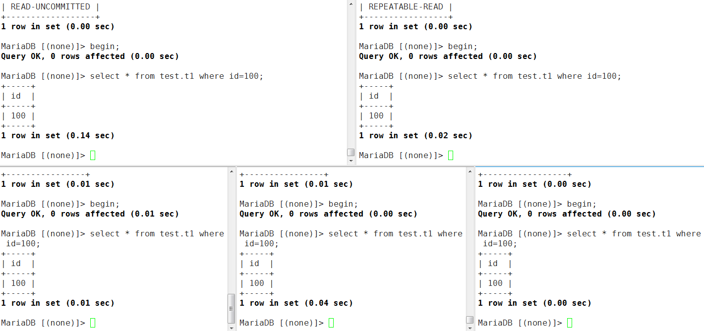

* session5中将id=100的行改为200，发现出现死锁，这是因为session4为SERIALIZABLE，查看id=100的行会被加上一个共享锁S，而其他三种模式都是不加锁的，使用一致性非锁定读。

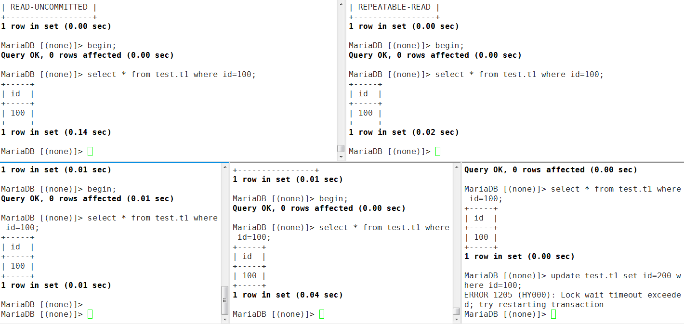

```shell
MariaDB [(none)]> select * from information_schema.innodb_locks\G;
*************************** 1. row ***************************
    lock_id: 909:0:308:2
lock_trx_id: 909
  lock_mode: X
  lock_type: RECORD
 lock_table: `test`.`t1`
 lock_index: `PRIMARY`
 lock_space: 0
  lock_page: 308
   lock_rec: 2
  lock_data: 100
*************************** 2. row ***************************
    lock_id: 90A:0:308:2
lock_trx_id: 90A
  lock_mode: S
  lock_type: RECORD
 lock_table: `test`.`t1`
 lock_index: `PRIMARY`
 lock_space: 0
  lock_page: 308
   lock_rec: 2
  lock_data: 100
2 rows in set (0.01 sec)

ERROR: No query specified

MariaDB [(none)]> select * from information_schema.innodb_lock_waits\G;
*************************** 1. row ***************************
requesting_trx_id: 909
requested_lock_id: 909:0:308:2
  blocking_trx_id: 90A
 blocking_lock_id: 90A:0:308:2
1 row in set (0.04 sec)

ERROR: No query specified

MariaDB [(none)]> select * from information_schema.innodb_trx\G;
*************************** 1. row ***************************
                    trx_id: 90A
                 trx_state: RUNNING
               trx_started: 2016-12-15 17:08:01
     trx_requested_lock_id: NULL
          trx_wait_started: NULL
                trx_weight: 2
       trx_mysql_thread_id: 5
                 trx_query: NULL
       trx_operation_state: NULL
         trx_tables_in_use: 0
         trx_tables_locked: 0
          trx_lock_structs: 2
     trx_lock_memory_bytes: 376
           trx_rows_locked: 1
         trx_rows_modified: 0
   trx_concurrency_tickets: 0
       trx_isolation_level: SERIALIZABLE
         trx_unique_checks: 1
    trx_foreign_key_checks: 1
trx_last_foreign_key_error: NULL
 trx_adaptive_hash_latched: 0
 trx_adaptive_hash_timeout: 10000
*************************** 2. row ***************************
                    trx_id: 909
                 trx_state: LOCK WAIT
               trx_started: 2016-12-15 17:02:04
     trx_requested_lock_id: 909:0:308:2
          trx_wait_started: 2016-12-15 17:10:18
                trx_weight: 2
       trx_mysql_thread_id: 4
                 trx_query: update test.t1 set id=200 where id=100
       trx_operation_state: starting index read
         trx_tables_in_use: 1
         trx_tables_locked: 1
          trx_lock_structs: 2
     trx_lock_memory_bytes: 1248
           trx_rows_locked: 1
         trx_rows_modified: 0
   trx_concurrency_tickets: 0
       trx_isolation_level: REPEATABLE READ
         trx_unique_checks: 1
    trx_foreign_key_checks: 1
trx_last_foreign_key_error: NULL
 trx_adaptive_hash_latched: 0
 trx_adaptive_hash_timeout: 10000
*************************** 3. row ***************************
                    trx_id: 908
                 trx_state: RUNNING
               trx_started: 2016-12-15 17:02:02
     trx_requested_lock_id: NULL
          trx_wait_started: NULL
                trx_weight: 0
       trx_mysql_thread_id: 3
                 trx_query: NULL
       trx_operation_state: NULL
         trx_tables_in_use: 0
         trx_tables_locked: 0
          trx_lock_structs: 0
     trx_lock_memory_bytes: 376
           trx_rows_locked: 0
         trx_rows_modified: 0
   trx_concurrency_tickets: 0
       trx_isolation_level: READ COMMITTED
         trx_unique_checks: 1
    trx_foreign_key_checks: 1
trx_last_foreign_key_error: NULL
 trx_adaptive_hash_latched: 0
 trx_adaptive_hash_timeout: 10000
*************************** 4. row ***************************
                    trx_id: 906
                 trx_state: RUNNING
               trx_started: 2016-12-15 17:01:57
     trx_requested_lock_id: NULL
          trx_wait_started: NULL
                trx_weight: 0
       trx_mysql_thread_id: 6
                 trx_query: NULL
       trx_operation_state: NULL
         trx_tables_in_use: 0
         trx_tables_locked: 0
          trx_lock_structs: 0
     trx_lock_memory_bytes: 376
           trx_rows_locked: 0
         trx_rows_modified: 0
   trx_concurrency_tickets: 0
       trx_isolation_level: REPEATABLE READ
         trx_unique_checks: 1
    trx_foreign_key_checks: 1
trx_last_foreign_key_error: NULL
 trx_adaptive_hash_latched: 0
 trx_adaptive_hash_timeout: 10000
*************************** 5. row ***************************
                    trx_id: 905
                 trx_state: RUNNING
               trx_started: 2016-12-15 17:01:39
     trx_requested_lock_id: NULL
          trx_wait_started: NULL
                trx_weight: 0
       trx_mysql_thread_id: 2
                 trx_query: select * from information_schema.innodb_trx
       trx_operation_state: NULL
         trx_tables_in_use: 0
         trx_tables_locked: 0
          trx_lock_structs: 0
     trx_lock_memory_bytes: 376
           trx_rows_locked: 0
         trx_rows_modified: 0
   trx_concurrency_tickets: 0
       trx_isolation_level: READ UNCOMMITTED
         trx_unique_checks: 1
    trx_foreign_key_checks: 1
trx_last_foreign_key_error: NULL
 trx_adaptive_hash_latched: 0
 trx_adaptive_hash_timeout: 10000
5 rows in set (0.00 sec)

ERROR: No query specified

```

* session4中提交事务，则id=100的行锁被解除，我们关闭session4，下图为最新的情况

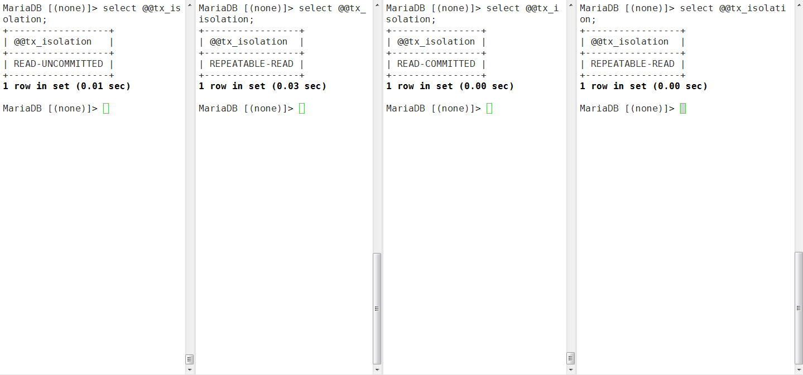

* session5，修改id=100的行，改为200，不提交事务，session1-,3分别查看id=100的值，观察情况

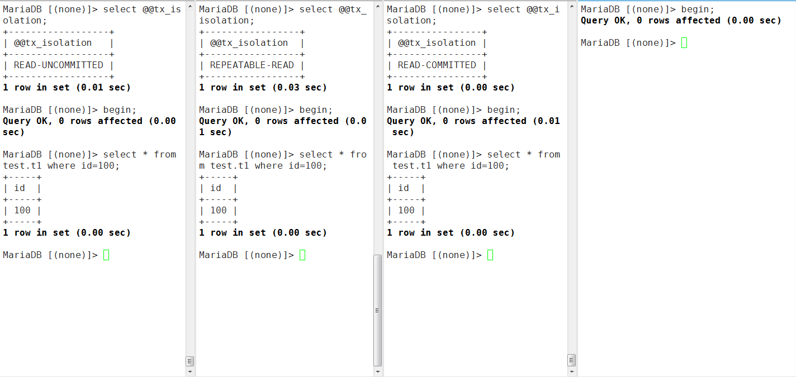

* RU级别的会话中的事务在session5中事务未提交的情况下，就能够查看到最新的行记录了

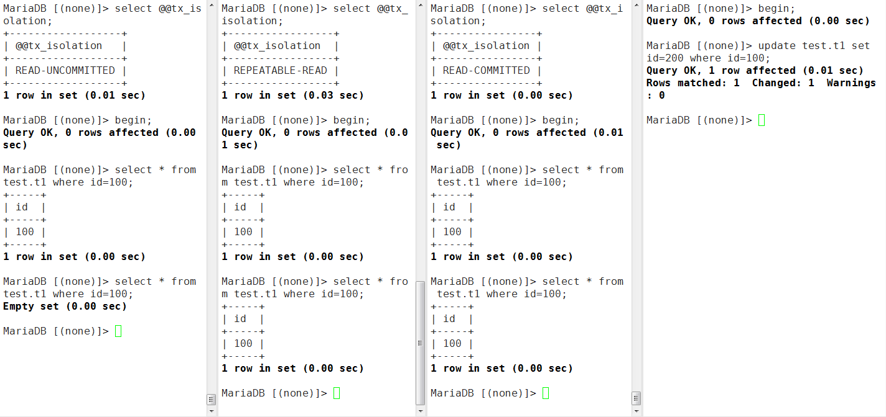

* RC级别的会话中的事务在session5会话的事务提交后就能够查看到最新的行记录了 

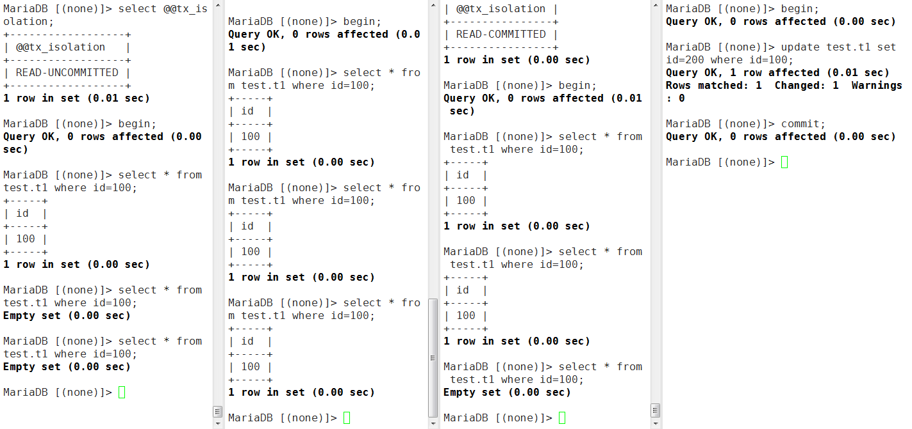

*　RR级别的会话中必须在session5的事务提交后并且自己的事务也提交后才能查到最新的行记录


## 实现一致性锁定读

InnoDB默认是可重复读的（REPEATABLE READ），MVCC多版本并发控制，实现一致性地非锁定读操作。

InnoDB存储引擎的select操作使用一致性非锁定读；也就是说，select操作不会去请求共享锁S；

如何显示地使用一致性锁定读呢？

* 第一种方法，显式地加共享锁S：select * from t1 where id=1 lock on share mode;
* 第二种方法，显式地加排他锁X：select * from t1 where id=1 for update;

### 实践1：设置innodb申请锁等待超时时间

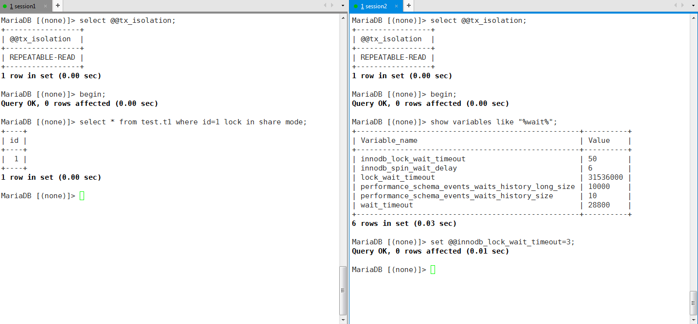

```shell
MariaDB [(none)]> set @@innodb_lock_wait_timeout=3;
Query OK, 0 rows affected (0.01 sec)
```

### 实践2：设置一致性锁定读，加共享锁测试

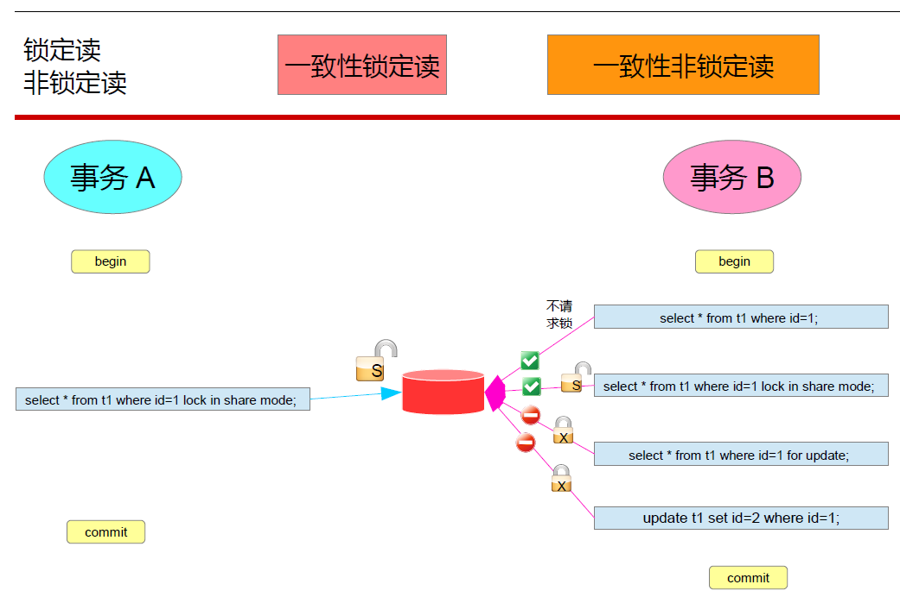

打开两个会话，分别按照图片中去做测试

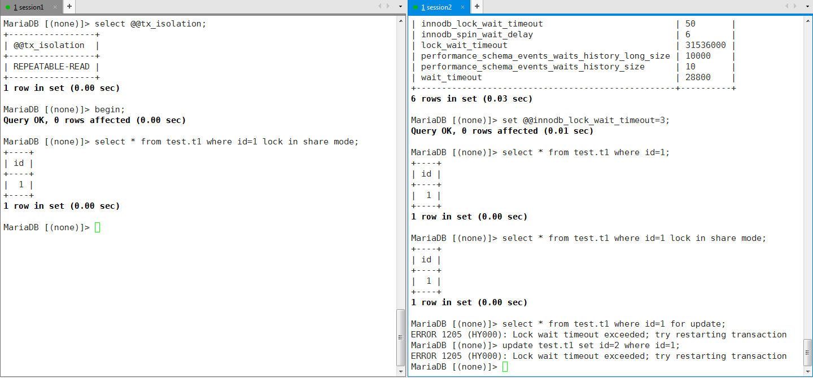

从实践中可以得到以下信息:

* 事务A对id=1的行申请了共享S锁之后，事务B要么使用一致性非锁定读，即不请求锁，或者使用一致性锁定读的共享锁，即请求共享S锁
* 而事务B中需要请求排他锁的写操作都不能执行，每次都是锁请求等待超时


### 实践3：设置一致性锁定读，加排他锁测试

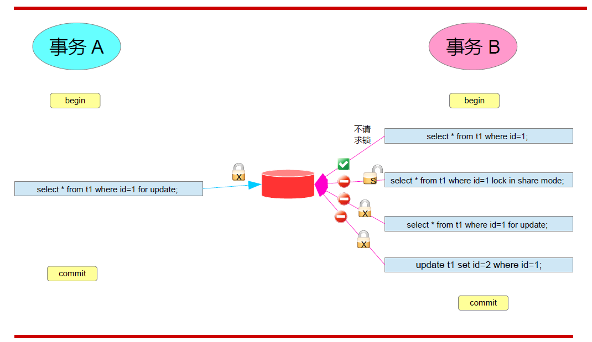

这一次事务A以及对id=1的行申请了排他锁X，按照下图做测试：


从实践中可以得到以下信息:

* 事务A对id=1的行申请了排他锁X之后，事务B只能使用一致性非锁定读，即不请求锁
* 而事务B中需要请求锁的行为都会等待超时，包括排他锁的写操作和共享锁的读操作都不能执行


## 认识锁的算法

nnoDB存储引擎的锁的算法有三种：

* Record lock：单个行记录上的锁
* Gap lock：间隙锁，锁定一个范围，不包括记录本身
* Next-key lock：record+gap 锁定一个范围，包含记录本身

Lock的精度（type）分为 行锁、表锁、意向锁

Lock的模式（mode）分为:

* 锁的类型 ——【读锁和写锁】或者【共享锁和排他锁】即 【X or S】
* 锁的范围 ——【record lock、gap lock、Next-key lock】

### 知识点

1. innodb对于行的查询使用next-key lock
2. Next-locking keying为了解决Phantom Problem幻读问题
3. 当查询的索引含有唯一属性时，将next-key lock降级为record key
4. Gap锁设计的目的是为了阻止多个事务将记录插入到同一范围内，而这会导致幻读问题的产生
5. 有两种方式显式关闭gap锁：（除了外键约束和唯一性检查外，其余情况仅使用record lock）
	A. 将事务隔离级别设置为RC
	B. 将参数innodb_locks_unsafe_for_binlog设置为1

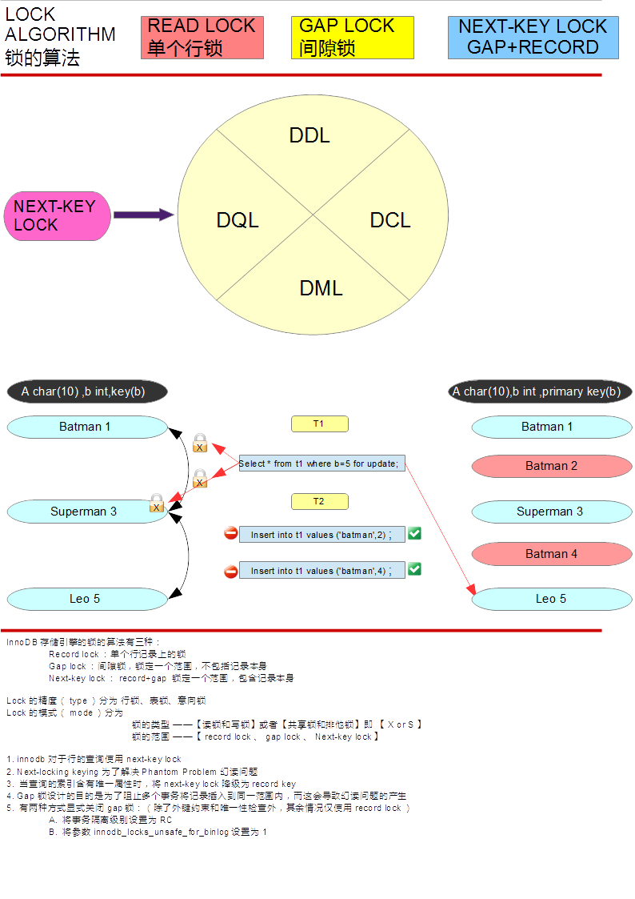
	
### 实践1： 验证next-key lock降级为record key

创建db1.t1表，有列a和b，分别为char(10)和int型，并且b为key，注意b列为索引列，但并不是主键，因此不是唯一的。

```shell
MariaDB [db1]> create table db1.t1 (a char(10),b int,key (b));
Query OK, 0 rows affected (0.03 sec)

MariaDB [db1]> insert into db1.t1 values ('batman',1),('superman',3),('leo',5);
Query OK, 3 rows affected (0.15 sec)
Records: 3  Duplicates: 0  Warnings: 0

MariaDB [db1]> select * from db1.t1;
+----------+------+
| a        | b    |
+----------+------+
| batman   |    1 |
| superman |    3 |
| leo      |    5 |
+----------+------+
3 rows in set (0.02 sec)
```

接下来开启两个事务T1和T2，T1中查看b=3的行，显式加排他锁；T1未提交事务时，T2事务开启并尝试插入新行a='batman',b=2和a='batman',b=4；

```shell
#事务T1
MariaDB [db1]> begin;
Query OK, 0 rows affected (0.00 sec)

MariaDB [db1]> select * from db1.t1 where b=3 for update;
+----------+------+
| a        | b    |
+----------+------+
| superman |    3 |
+----------+------+
1 row in set (0.12 sec)

#事务T2
MariaDB [db1]> begin;
Query OK, 0 rows affected (0.00 sec)

MariaDB [db1]> insert into db1.t1 values ('batman',2);
ERROR 1205 (HY000): Lock wait timeout exceeded; try restarting transaction
MariaDB [db1]> insert into db1.t1 values ('batman',4);
ERROR 1205 (HY000): Lock wait timeout exceeded; try restarting transaction
```

发现T2事务中不能插入新行a='batman',b=2和a='batman',b=4；可以查看当前innodb锁的信息

```shell
MariaDB [db1]> select * from information_schema.innodb_locks\G;
*************************** 1. row ***************************
    lock_id: 111B:0:334:3
lock_trx_id: 111B
  lock_mode: X,GAP
  lock_type: RECORD
 lock_table: `db1`.`t1`
 lock_index: `b`
 lock_space: 0
  lock_page: 334
   lock_rec: 3
  lock_data: 3, 0x00000000020E
*************************** 2. row ***************************
    lock_id: 111A:0:334:3
lock_trx_id: 111A
  lock_mode: X
  lock_type: RECORD
 lock_table: `db1`.`t1`
 lock_index: `b`
 lock_space: 0
  lock_page: 334
   lock_rec: 3
  lock_data: 3, 0x00000000020E
2 rows in set (0.01 sec)

ERROR: No query specified

MariaDB [db1]> select * from information_schema.innodb_lock_waits\G;
*************************** 1. row ***************************
requesting_trx_id: 111B
requested_lock_id: 111B:0:334:3
  blocking_trx_id: 111A
 blocking_lock_id: 111A:0:334:3
1 row in set (0.09 sec)

MariaDB [db1]> select * from information_schema.innodb_lock_waits\G;
*************************** 1. row ***************************
requesting_trx_id: 111B
requested_lock_id: 111B:0:334:4
  blocking_trx_id: 111A
 blocking_lock_id: 111A:0:334:4
1 row in set (0.00 sec)

ERROR: No query specified

MariaDB [db1]> select * from information_schema.innodb_locks\G;
*************************** 1. row ***************************
    lock_id: 111B:0:334:4
lock_trx_id: 111B
  lock_mode: X,GAP
  lock_type: RECORD
 lock_table: `db1`.`t1`
 lock_index: `b`
 lock_space: 0
  lock_page: 334
   lock_rec: 4
  lock_data: 5, 0x00000000020F
*************************** 2. row ***************************
    lock_id: 111A:0:334:4
lock_trx_id: 111A
  lock_mode: X,GAP
  lock_type: RECORD
 lock_table: `db1`.`t1`
 lock_index: `b`
 lock_space: 0
  lock_page: 334
   lock_rec: 4
  lock_data: 5, 0x00000000020F
2 rows in set (0.11 sec)

ERROR: No query specified
```

我们看到T2事务的两次插入动作都在请求排他锁，但是此时T1事务已经在加了next-key lock(record + gap)，表现范围为b的(1,5)，包括记录3，所以T2事务在T1事务解锁之间，不能插入到b的(1,5)范围内

× `lock_mode: X,GAP` lock_mode 可以理解为 `读锁还是写锁？`；`是在什么范围上锁？`;此处加的写锁即排他锁；范围是(1,5)
* `lock_type: RECORD` 表示锁的精度，根据存储引擎不同，innodb是行锁，MYISAM是表锁

删除db1.t1表，重新创建db1.t1表，有列a和b，分别为char(10)和int型，并且b为primay key，因此b列是唯一的。

```shell
MariaDB [db1]> drop tables t1;
Query OK, 0 rows affected (0.12 sec)

MariaDB [db1]> create table db1.t1 (a char(10),b int ,primary key (b));
Query OK, 0 rows affected (0.02 sec)

MariaDB [db1]> insert into db1.t1 values ('batman',1),('superman',3),('leo',5);
Query OK, 3 rows affected (0.12 sec)
Records: 3  Duplicates: 0  Warnings: 0

MariaDB [db1]> select * from db1.t1;
+----------+---+
| a        | b |
+----------+---+
| batman   | 1 |
| superman | 3 |
| leo      | 5 |
+----------+---+
3 rows in set (0.08 sec)
```

接下来开启两个事务T1和T2，T1中查看b=3的行，显式加排他锁；T1未提交事务时，T2事务开启并尝试插入新行a='batman',b=2和a='batman',b=4；

```shell
#事务T1
MariaDB [db1]> begin;
Query OK, 0 rows affected (0.00 sec)

MariaDB [db1]> select * from db1.t1 where b=3 for update;
+----------+---+
| a        | b |
+----------+---+
| superman | 3 |
+----------+---+
1 row in set (0.14 sec)

#事务T2
MariaDB [db1]> begin;
Query OK, 0 rows affected (0.00 sec)

MariaDB [db1]> insert into db1.t1 values ('batman',2);
Query OK, 1 row affected (0.00 sec)

MariaDB [db1]> insert into db1.t1 values ('batman',4);
Query OK, 1 row affected (0.00 sec)
```

继续在T2事务中尝试查看b=3的行，显式加共享锁。

```shell
#事务T2
MariaDB [db1]> select * from db1.t1 where b=3 lock in share mode;
ERROR 1205 (HY000): Lock wait timeout exceeded; try restarting transaction
```

发现T2事务中可以插入新行a='batman',b=2和a='batman',b=4；但是不能查看b=3的行，接下来我们查看当前innodb锁的信息

```shell
MariaDB [db1]> select * from information_schema.innodb_locks\G;
*************************** 1. row ***************************
    lock_id: 1122:0:337:3
lock_trx_id: 1122
  lock_mode: S
  lock_type: RECORD
 lock_table: `db1`.`t1`
 lock_index: `PRIMARY`
 lock_space: 0
  lock_page: 337
   lock_rec: 3
  lock_data: 3
*************************** 2. row ***************************
    lock_id: 1121:0:337:3
lock_trx_id: 1121
  lock_mode: X
  lock_type: RECORD
 lock_table: `db1`.`t1`
 lock_index: `PRIMARY`
 lock_space: 0
  lock_page: 337
   lock_rec: 3
  lock_data: 3
2 rows in set (0.02 sec)

ERROR: No query specified

MariaDB [db1]> select * from information_schema.innodb_lock_waits\G;
*************************** 1. row ***************************
requesting_trx_id: 1122
requested_lock_id: 1122:0:337:3
  blocking_trx_id: 1121
 blocking_lock_id: 1121:0:337:3
1 row in set (0.00 sec)

ERROR: No query specified
```

从以上信息可以看到，T1事务当前只在b=3所在的行上加了写锁，排他锁，并没有同时使用gap锁来组成next-key lock。

到此，已经证明了，当查询的索引含有唯一属性时，将next-key lock降级为record key

我们第二次创建的t1表的列b是主键，而主键必须是唯一的。


### 实践2： 关闭GAP锁

